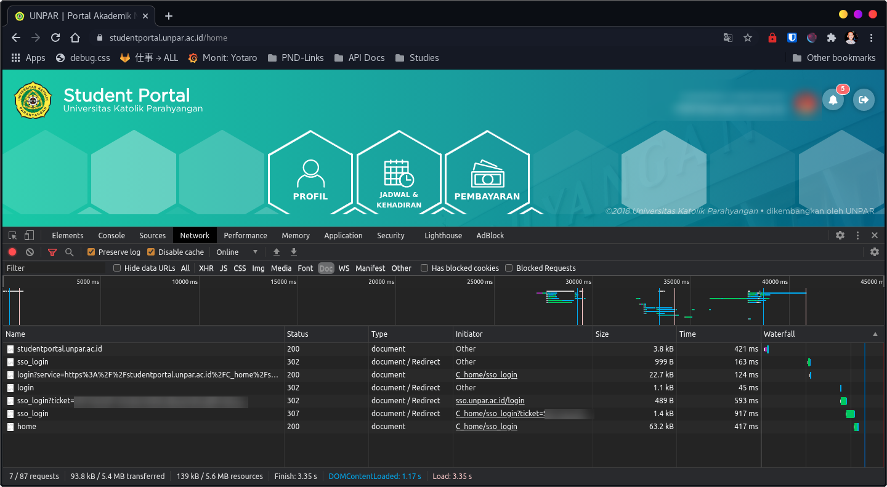

# Contributing

**BAHASA (id_ID)** \
*English section will be added in the future. For the time being, please consider using Google Translate to translate this document. Thank you.*

Terima kasih telah mengecek dokumen kontribusi ini. Pada dokumen ini akan dijelaskan untuk mempersiapkan lingkungan pengembangan dan memulai kontribusi.

## Mempersiapkan Lingkungan Pengembangan

Lingkungan pengembangan yang digunakan oleh proyek ini membutuhkan:

- Composer
- PHP v7.3 (atau lebih tinggi)
- Peramban (Browser) dengan DevTools
- Git

Anda dituntut untuk dapat mengoperasikan DevTools dengan baik. Anda dapat mencari tutorial cara menggunakan DevTools pada peramban Anda untuk memulai. Kita akan fokus pada tab *Networking* pada DevTools Anda untuk melihat komunikasi yang terjadi antara Peladen (server) dan Peramban Anda.

## Memulai Kontribusi

Anda dapat mempelajari kelas yang sudah ada untuk memulai membuat kelas turunan baru. Sebagai contoh Anda dapat mengecek bagian [Jadwal](src/Data/Jadwal.php).

Anda diharuskan untuk menaati gaya kode yang digunakan pada proyek ini untuk berkontribusi. Gaya kode yang digunakan adalah PSR-4. Tidak menaati aturan ini akan berakibat pada kelas tersebut tidak dapat di Auto-load oleh Composer.